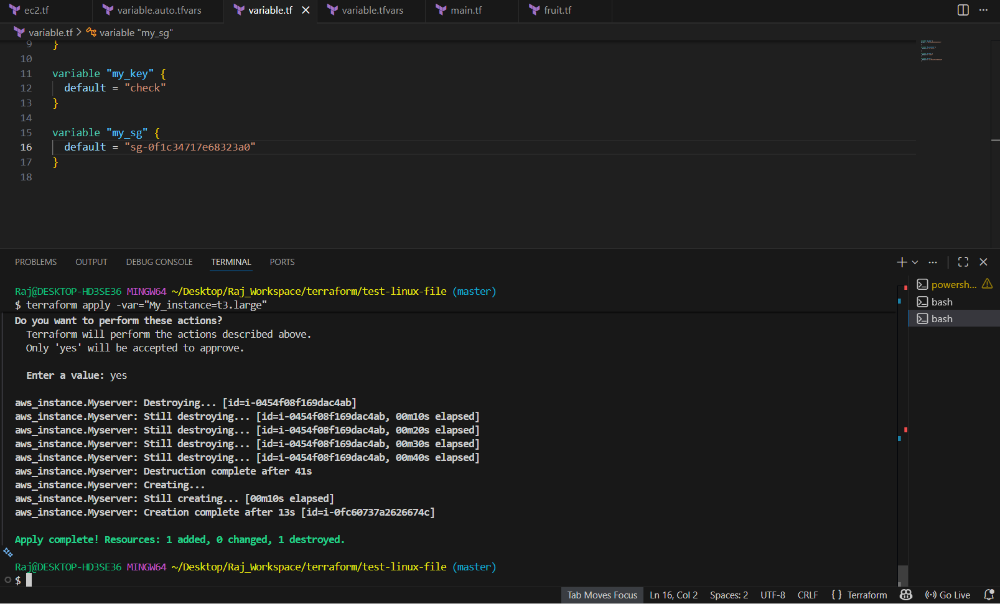
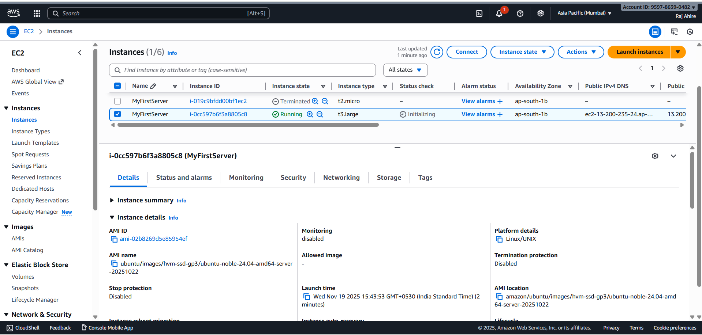
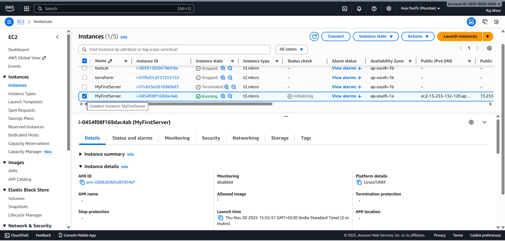
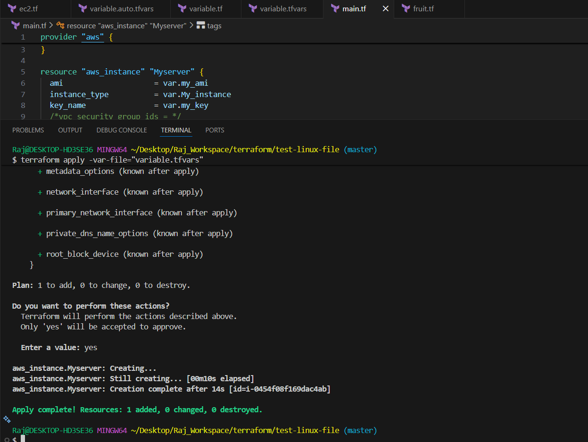
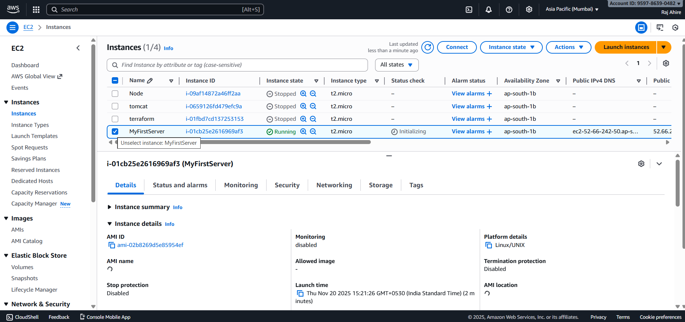

# Terraform Variable Files — Precedence

 Professional README for the Terraform lab: *Variable Files — Precedence*


## Overview

This repository demonstrates how Terraform resolves input variables when they are defined in multiple places (CLI flags, `.tfvars` files, environment variables, and `variable` blocks). The goal of this project is to show the order of precedence with practical examples and screenshots from an AWS EC2 provisioning exercise.

Use this README as a quick reference for how Terraform chooses variable values and as a guide to reproduce the examples shown in the screenshots folder (`img/`).

---

## Key takeaways 

* Terraform merges variable values from multiple sources and uses a defined precedence to decide which value to use.
* Command-line values are strongest and the `default` in a `variable` block is the weakest.
* Use clear naming and versioned `.tfvars` files for environment-specific configuration.

---

## Precedence (from highest to lowest)

Terraform resolves variables in this order (later sources override earlier ones):

1. **`-var` and `-var-file` options on the command line** (in the order provided)
2. **Any `*.auto.tfvars` or `*.auto.tfvars.json` files** (processed in lexical order)
3. **`terraform.tfvars.json` file**
4. **`terraform.tfvars` file**
5. **Environment variables** in the form `TF_VAR_<name>`
6. **`default` argument in the `variable` block** inside Terraform configuration


---

## Why this matters

When multiple sources supply the same variable name, Terraform will pick the value from the highest-precedence source. Knowing this order prevents surprises (e.g., when a `.tfvars` is ignored because a CLI flag overrides it) and helps structure configuration for teams and environments safely.

---

## Example file structure (this repo)

```
├── main.tf
├── ec2.tf
├── variables.tf
├── variable.tfvars
├── variable.auto.tfvars
├── img/
│   ├── -var cli server.png
│   ├── -var_cli terraform_apply.png
│   ├── variable_auto_tfvars_server.png
│   ├── variable_auto_tfvars_terraform apply.png
│   ├── variable_tf_server.png
│   ├── variable_tf_terraform apply.png
│   ├── variable_tfvars_server.png
│   └── variable_tfvars_terraform_apply.png
└── README.md
```

---

## How to reproduce locally

1. Ensure you have Terraform installed (v1.x recommended) and AWS credentials available (`~/.aws/credentials` or environment variables).
2. Initialize the working directory:

```bash
terraform init
```

3. Run `terraform plan` / `apply` using different value sources to observe precedence. Examples:

```bash
# Use default values from variables.tf
terraform apply --auto-approve

# Use a tfvars file explicitly
terraform apply -var-file="variable.tfvars" --auto-approve

# Use CLI override (highest precedence)
terraform apply -var="My_instance=t3.large" --auto-approve

# Use environment variable
export TF_VAR_My_instance=t3.micro
terraform apply --auto-approve
```

4. Observe instance type / other variable-driven results in the AWS Console screenshots recorded in `img/`.

---

## Security note

Never commit plaintext secrets (passwords, keys, tokens) to your Git repository. Use Vault, AWS Secrets Manager, or CI/CD secret stores and pass them via environment variables or secure backend integrations.

---

## Screenshots

Below are the project screenshots (they live in the `img/` folder). If you want to preview them here, use the links to the files stored in the project.











---


All previously embedded images are preserved below (files live under `img/` in the repo). If you prefer inline previews in this README, ensure that your Git host allows rendering images with spaces in names or rename them to use dashes or underscores; e.g. `var-cli-server.png`.





---
